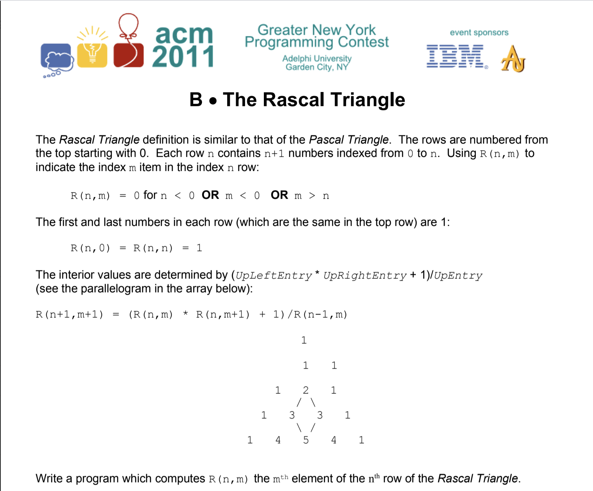

#Rascal Triangle

The problem that this code comes to solve is from the 
ACM Greater New York Programming Contest in 2011. 

The input consists of an integer specifying how many data
sets will follow. The data sets are then listed as the
number of the data set, the row number, and then the column
number. 
The input used in this implementation is:  
5 
1 4 0 
2 4 2 
3 45678 12345 
4 12345 9876 
5 34567 11398 
 The output consists of the number of the data set,
 followed by the value that is found at the specified row
 and column for that data set. 
 The output for this implementation is:  
 1 1 
 2 5 
 3 411495886 
 4 24383845 
 5 264080263
